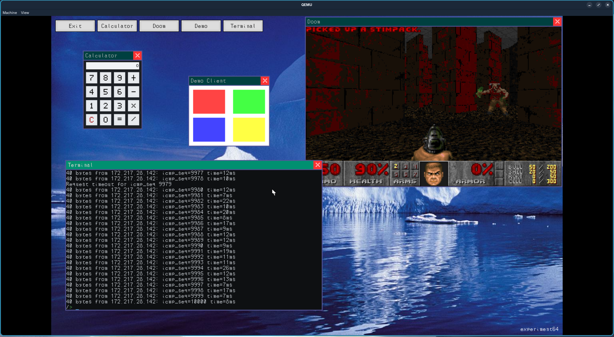
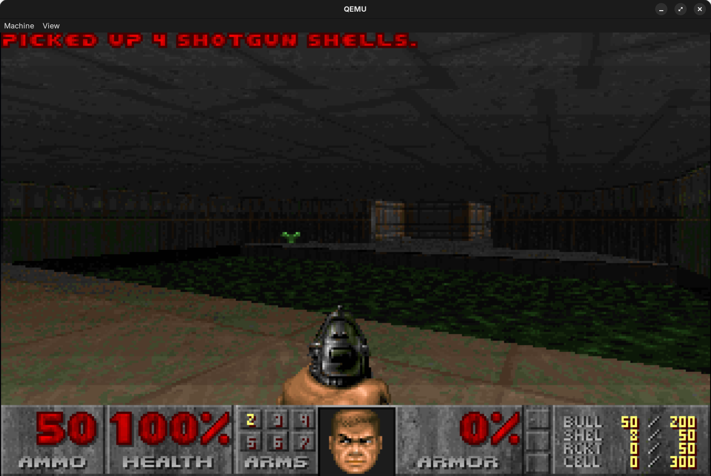
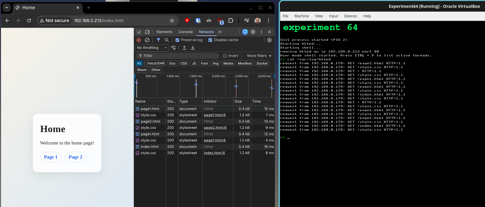
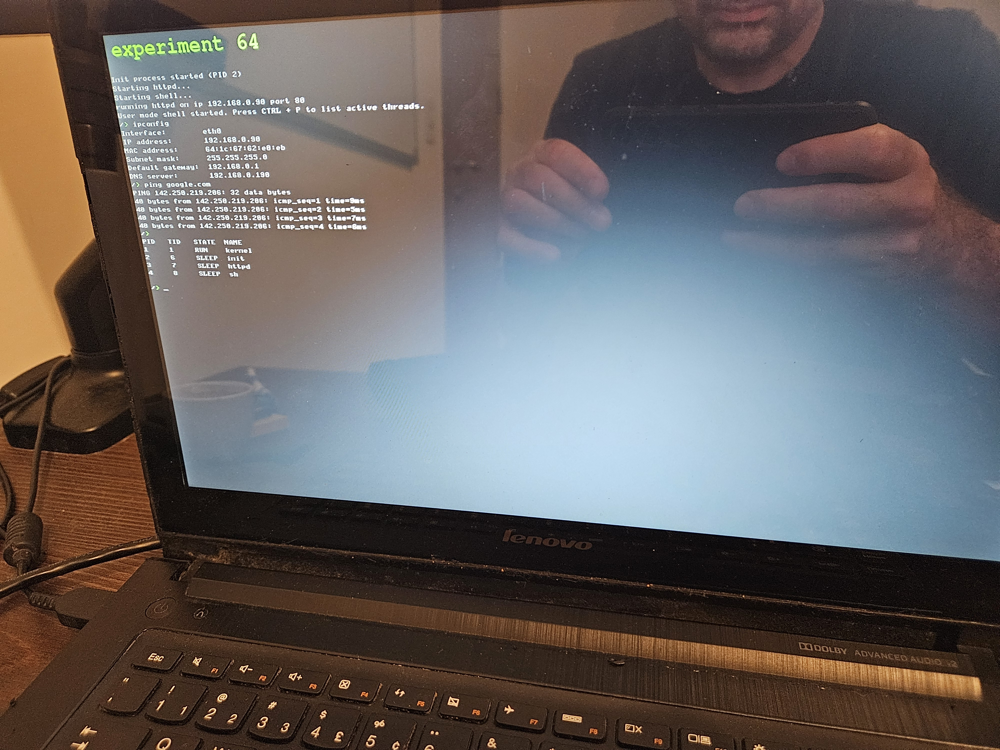

# experiment 64

An x86_64 hobby kernel with a VFS layer, ext2/FAT32 support and a libc/tiny shell.


## Toolchain and build requirements

- Cross toolchain: `x86_64-elf-gcc` and binutils
- QEMU for running and for `make tests` / `make run`
- Optional: `clangd` / `clang-tidy` if you use the provided targets

## Common targets

- `make image.hdd` – build kernel + userland and assemble disk images
- `make run` – boot the kernel in QEMU with the generated image
- `make vbox` – boot the kernel in VirtualBox with the generated images (USB disk attached)
- `make tests` – build a test image and run the in-kernel test suite (UBSan enabled)
- `make check` – lint/static-analysis wrapper (clangd + clang-tidy)
- `make clangd-check` / `make clang-tidy` – language server / lint helpers (no .S files)

## Tests

To run the tests, use the following command:

```bash
make tests
```

`make tests` will automatically clean up any previous test artifacts and build the necessary components before executing
the tests.
The tests run with a timeout of 120 seconds to prevent hanging. If you see that a timeout has occurred, it means the
last
test did not complete successfully within the allotted time.
To know the tests completed, you need to see either "ALL TESTS PASSED" or "SOME TESTS FAILED" messages at the end.

### Custom test framework

- Tests live under `kernel/tests/` and are discovered via a linker section (`.test_array`)
- The runner prints `[PASS]/[FAIL]` with per-test timing and a compact summary
- Output is captured and only flushed on failure to keep logs short


## Checks

To ensure code quality and consistency, run the following checks:

```bash
make check
```

This command will run linting and static analysis on the codebase.

## Running

To actually run the OS inside QEMU, use the following command:

```bash
make run
```

To boot the disk image as a USB mass storage device:

```bash
make run-usb
```

## Running on real hardware

To write the disk image to a real disk, use the following command:

```bash
make disk DISK=/dev/sdX
```

By default, the disk image is written to `/dev/sdb` so, **BE CAREFUL**!

## Disk images

- `image.hdd`: GPT image with ESP (FAT32), root ext2 and data FAT32
- `image2.ide`: secondary IDE disk with an ext2 partition
- `image3.usb`: USB mass storage disk with an ext2 partition

## License note

The project is MIT licensed except for the Atheros AR8162 driver files
(`kernel/drivers/atl1c.c`, `include/drivers/atl1c.h`), which are GPL-2.0-only.

## Kernel overview

- **Arch/boot**: x86_64, Limine bootloader, Intel-syntax asm, SMP bring-up, APIC + IOAPIC, IDT/GDT, syscall entry
- **Memory**: physical allocator (bitmap), DMA allocator (contiguous, HHDM-mapped), virtual memory manager (4 KiB pages),
  kernel heap (slab + big allocs, panics on OOM), stack protector, UBSan, VMA tracking for mmap, address space layout in
  `docs/address_space.md`
- **Timing**: PIT for ticks, TSC calibration for timing
- **Drivers**: serial/uart, framebuffer console, keyboard, mouse, IDE/ATA and AHCI via PCI scan, GPT parsing, USB xHCI (
  USB 3.x enumeration + BOT mass storage read/write; EHCI quiesce + port routing), e1000 NIC, framebuffer device
  `/dev/fb0`
- **Networking**: e1000 and Atheros AR8162 driver, Ethernet/IPv4/UDP, ARP, ICMP (ping), DHCP client, and a little DNS
  client in userland.
- **VFS & filesystems**: VFS layer with devfs nodes, ext2 mounted at `/` (new entries default to 0755/0644), FAT32
  mounted at `/mnt`, ESP FAT32 mounted at `/boot`, second-disk ext2 (if present) mounted at `/disk1`, USB ext2 (if
  present and not the boot device) mounted at `/usb`. The boot disk is auto-detected across IDE/AHCI/USB by scanning
  GPT (ESP + root).
- **Process/tasking**: basic scheduler, spinlocks/sleeplocks, syscall layer (see `user/libc/src/syscall.c`), user
  programs (`init`, `sh`, `ls`, `cat`, `edit`, `grep`, `wc`, etc.)
- **Syscalls & features**: `execve` with argv/envp, `waitpid` (WNOHANG), `ioctl` (TTY window size, foreground PID, framebuffer
  queries, keyboard flush, network `GETNETINFO`; see `docs/ioctl.md`), `mmap`/`munmap` for `/dev/fb0`, `link`/`unlink`,
  `getcwd`, full `open` flag handling (create/trunc/append), `mmap`-backed framebuffer access, user pointer
  validation for canonical and user-mapped ranges
- **Logging**: boot messages mirrored to `/var/log/boot` once the root fs is up with storage cache flush
- **Debug**: symbolized stack traces, panic trapping in tests, test output capture, targeted PCI config dumps and USB
  controller interface logs

## GUI

It has the *beginnings* of a GUI, with a simple window manager and basic graphical primitives based
on https://github.com/JMarlin/wsbe



## DOOM

I also ported DOOM. It only runs full screen, not inside a window.



Doomgeneric is cloned on demand and patched; see `docs/doom.md`.

## Web server

A small web server is also included.



## Real hardware

The OS running on an old Lenovo laptop with an Atheros AR8162 NIC.


